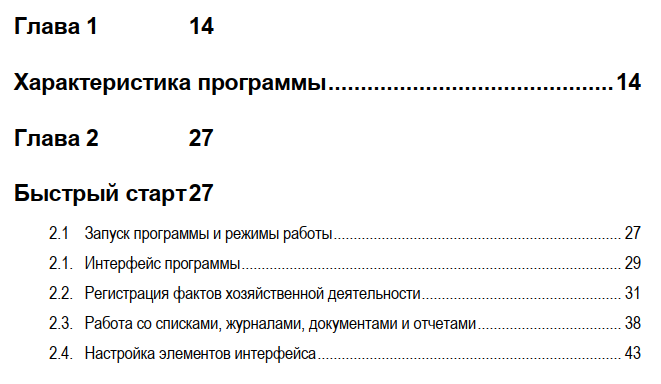

**TOC from pdf file:**



is converted to `structure.json`:
```json
{
    "1": {
        "text": "Программный продукт ..."
    },
    "2": {
        "title": "Быстрый старт",
        "sections": {
            "2.1": {
                "title": "Запуск программы и режимы работы",
                "text": "Пользователь  конфигурации ...",
                "subsections": {}
            },
            "2.1.": {
                "title": "Интерфейс программы",
                "text": "Основной (рекомендуемый) ...",
                "subsections": {}
            },
            "2.2.": {
                "title": "Регистрация фактов хозяйственной деятельности",
                "text": "Основным способом ведения ...",
                "subsections": {}
            },
            "2.3.": {
                "title": "Работа со списками, журналами, документами и отчетами",
                "text": "Назначение форм списков ...",
                "subsections": {}
            },
            "2.4.": {
                "title": "Настройка элементов интерфейса",
                "text": "Пользователь может самостоятельно ...",
                "subsections": {}
            }
        }
    },
	...
}
```
